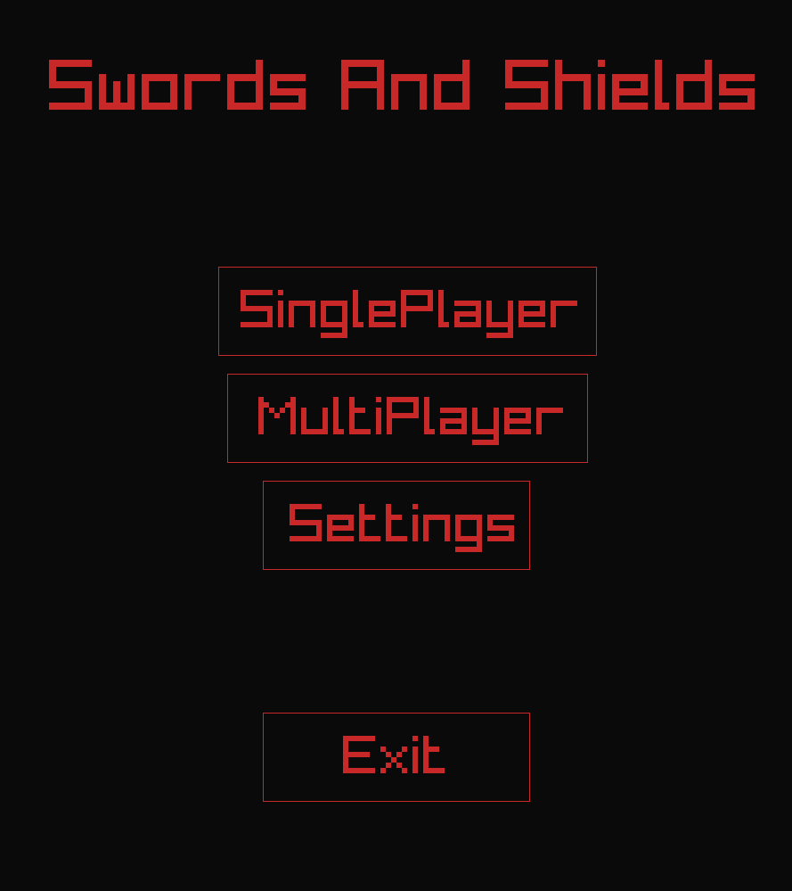
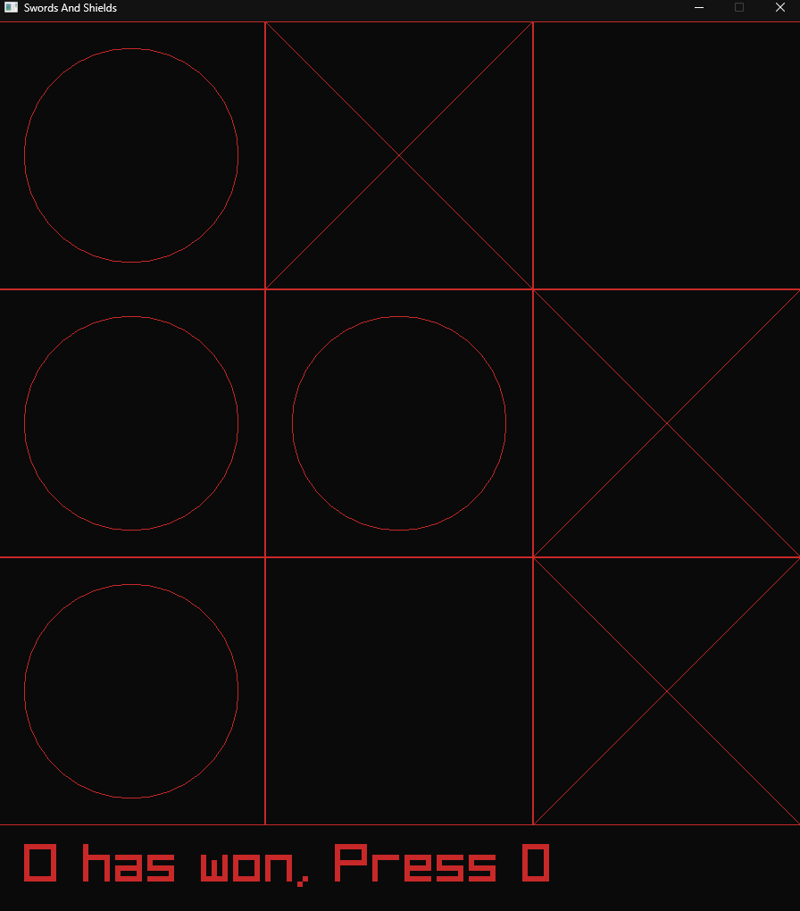

# Swords and sheilds
  Nortts and Crosses using RayLib.

Classic norts and croses written in c++ using raylib
Uses vcpkg package Manager for raylib dependency

## ToDo
  Make a menu: X, 
  Add singleplayer: X,
  Add Swords :)
  Add Sheilds ///
  online multiplayer ?

